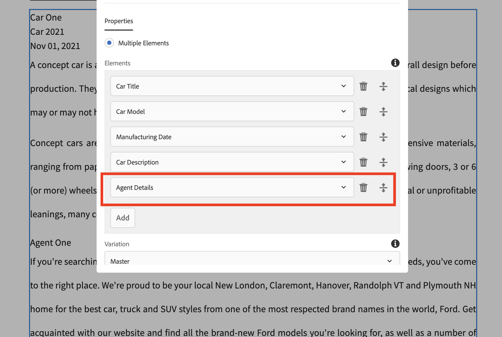

# LinkedContentFragment
getting Linked Content Fragment Content

Content Fragments (CF) allow us to manage page-independent content. They help us prepare content for use in multiple locations/over multiple channels. These are text-based editorial content that may include some structured data elements that are considered pure content without design or layout information. Content Fragments are intended to be used and reused across channels.

Usage
•	Highly structured data-entry/form-based content
•	Long-form editorial content (multi-line elements)
•	Content managed outside the life cycle of the channels delivering it

We have following content fragment as part of AEM
1.	Car details
2.	Agent details
And each car can have multiple agents or agents will be selling multiple cars. How can we link between Cars and Agents CF? and how can we get the linked content on to the page?

For more information please vist the blog: https://kirantech58867409.wordpress.com/2021/11/13/aem-get-linked-content-fragments-content/
